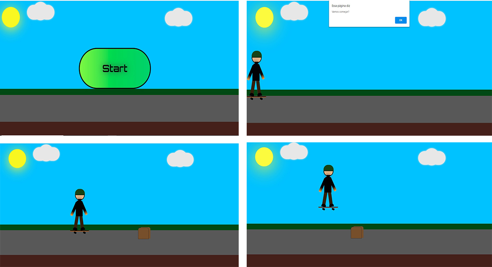
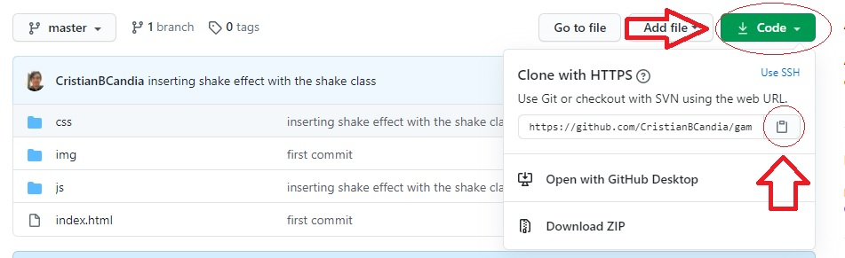

# Skate Game

Skate Game is a game project started to encourage everyone to learn CSS, HTML and Javascript while having fun.
 

## Preview

### About the game
* The game was implemented with the features of animating the character to walk straight on the skateboard, to jump use the space key.

#### Download VS Code (Windows)

* Click on this link -> <a href="https://code.visualstudio.com/download" target="_blank">vscode</a> to be redirected to the download page.

* Select the download option for windows according to the number of bits on your processor, 64-bit or 32-bit (<a href="https://www.techtudo.com.br/dicas-e-tutoriais/noticia/2014/08/como-saber-se-o-processador-do-seu-pc-windows-e-de-32-bits-ou-de-64-bits.html"  target="_blank">
know how many bits your processor has</a> ). 

* Click the green "code" button as the follow image instructs.

* After downloading, go to the folder where it was downloaded, double-click the executable and click next, accept creating a shortcut on the desktop and continue clicking next until the installation is complete, then go to the desktop, double click on the shortcut created and be happy.

## Clone the repository 
* Click on the green button, and then click on the folder icon as shown in the image below.

* Open your command prompt, go to the location where you want to place the repository, if necessary create a folder with the command "mkdir folder-name".
* After creating the folder, type the command "cd folder-name-created" to access the folder you created, then type the command "git clone https: // hostname / YOUR-USERNAME / YOUR-REPOSITORY".
* Access the repository folder and click on the "index.html" file to display the result of the code in your browser and have fun.